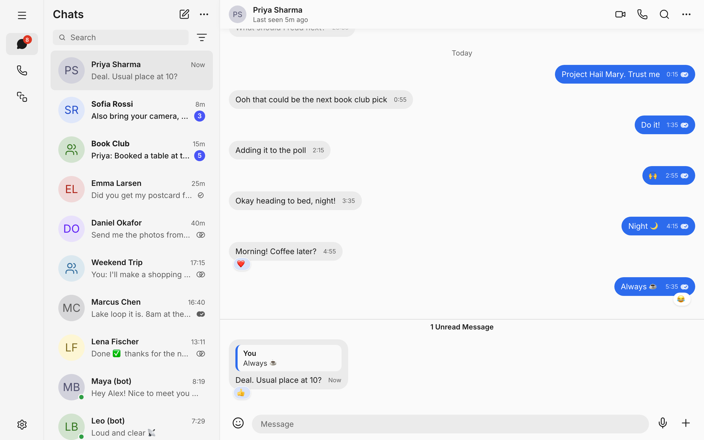
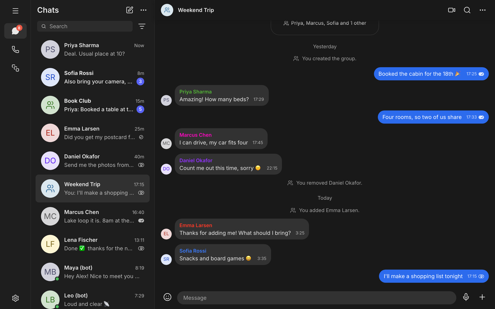
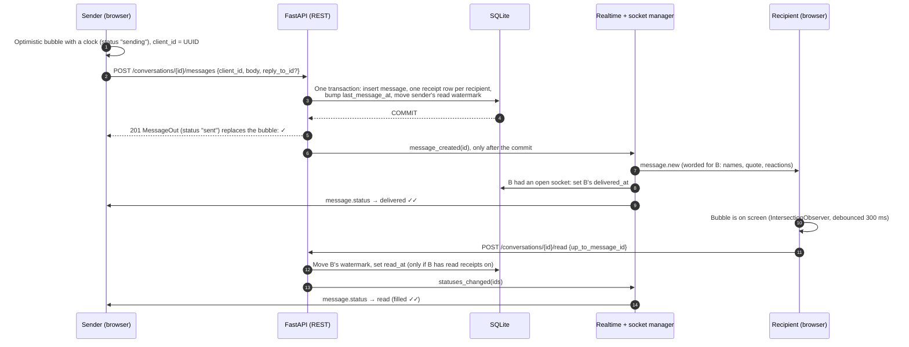
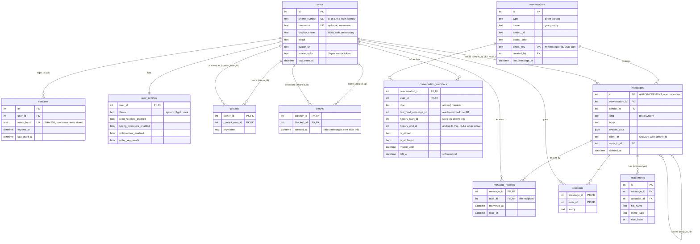

# Signal Clone

**Author:** Aryan Goel
**Roll no:** 23/IT/209
**College:** Delhi Technological University
**Made for:** Assignment Submission for Scaler AI Labs (SDE Fullstack Assignment: Signal clone)

A full-stack clone of **Signal Desktop**: phone-number sign-in, contacts, one-to-one and group chats, real-time delivery with sending → sent → delivered → read ticks, typing indicators, presence, groups with admin controls, replies and emoji reactions, settings, light/dark themes and a mobile layout. Built with Next.js, FastAPI, SQLite and native WebSockets.

| Light theme: a DM with a reply and reactions | Dark theme: a group with system messages |
|---|---|
|  |  |

## Live demo

- **App:** `https://signal-clone-lime-sigma.vercel.app/`
- **API:** `https://signalclone-production-5ee8.up.railway.app/` (health check: `https://signalclone-production-5ee8.up.railway.app//api/v1/health`, interactive docs: `https://signalclone-production-5ee8.up.railway.app//docs`)

**Demo accounts** (the verification code is always **`123456`**; the register screen has a "Demo accounts" panel that fills these in):

| Account | Phone | Use it for |
|---|---|---|
| Alex Rivera | `+1 555 010 0001` | Main demo user: DMs and groups with history, unread messages, groups where Alex is admin |
| Priya Sharma | `+1 555 010 0002` | Open in a second browser to watch messages, ticks, typing and reactions arrive live |
| Maya (bot), Leo (bot) | - | Message them from any account: they mark your message delivered, then read, type, and reply |

Any other valid phone number signs up a new account (with onboarding: name and photo).

## Tech stack

| Layer | Choice | Why |
|---|---|---|
| Frontend | **Next.js 16** (App Router), **TypeScript** (strict, no `any`), **Tailwind CSS v4** | Required by the brief. Tailwind maps every colour to theme tokens in one file, so light and dark share one set of names. |
| Client state | **Zustand** | Small stores (auth, chats, messages, typing, presence, settings) that WebSocket handlers can update outside React without prop drilling or a reducer boilerplate. |
| Backend | **Python 3.11, FastAPI**, Pydantic v2 | Typed request/response models give validation and OpenAPI docs for free. Native async WebSockets, no extra server. |
| ORM | **SQLAlchemy 2.x async** + `aiosqlite` | REST handlers, WebSocket handlers and bot tasks all run on one asyncio event loop: no threads, no locks, no thread-to-loop bridging. |
| Database | **SQLite** (WAL mode, foreign keys on) | Required by the brief. One file, zero setup; WAL lets reads run during a write. |
| Real-time | **Native FastAPI WebSockets** | One endpoint, JSON envelopes `{type, payload}`. No Socket.IO layer to explain. |
| Auth | Mocked OTP + **server-side hashed session tokens**, sent as `Authorization: Bearer` | Logout really revokes a session, and a leaked DB doesn't leak working tokens. |
| Tests | **pytest** + pytest-asyncio + httpx (215 tests) | Auth, messaging, receipts, groups, blocks, replies/reactions and the WebSocket events. |
| Hosting | **Railway** (Docker, persistent volume) + **Vercel** | Railway keeps a long-lived WebSocket process and a disk; Vercel serves Next.js. |

## Run locally

Prerequisites: **Python 3.11+** and **Node 24** (`frontend/.nvmrc`).

```bash
git clone <REPO_URL> signal-clone && cd signal-clone

# Backend: http://localhost:8000 (docs at /docs)
cd backend
python3.11 -m venv .venv && source .venv/bin/activate
pip install -r requirements-dev.txt     # runtime deps + pytest (requirements.txt is runtime only, for Docker)
cp .env.example .env
python -m app.seed                      # demo data; idempotent, safe to run again
uvicorn app.main:app --reload --port 8000

# Frontend: http://localhost:3000 (second terminal, from the repo root)
cd frontend
nvm use                                 # or any Node 24
npm install
cp .env.example .env.local
npm run dev
```

Open http://localhost:3000 and sign in with `+1 555 010 0001` / `123456`.

**Seed and tests**

```bash
cd backend && source .venv/bin/activate
python -m app.seed            # adds whatever is missing, changes nothing that exists
python -m app.seed --reset    # DESTRUCTIVE: drops all tables and seeds from scratch
pytest -q                     # 215 tests; each uses its own temporary database
```

Run the seed **before** starting uvicorn, or restart uvicorn after seeding, so the demo bots are recognised.

### Environment variables

`backend/.env` (all optional; defaults shown in `backend/.env.example`):

| Variable | Default | Purpose |
|---|---|---|
| `DATABASE_URL` | `sqlite+aiosqlite:///./app.db` | SQLite file. Three slashes = relative path, four = absolute (`sqlite+aiosqlite:////data/app.db`). |
| `UPLOADS_DIR` | `uploads` | Avatars and group photos, served at `/media`. |
| `CORS_ORIGINS` | `http://localhost:3000` | Comma-separated frontend origins (a trailing slash is stripped). |
| `SESSION_TTL_DAYS` | `30` | Session lifetime. |
| `DEMO_BOTS_ENABLED` | `true` | Turns the auto-replying demo bots on. |
| `DEMO_BOT_PHONES` | `+15550000001,+15550000002` | Which seeded users are bots. |
| `DEMO_BOT_DELAY_SCALE` | `1.0` | Multiplies the bots' delays (tests use 0). |

`frontend/.env.local` (inlined into the JavaScript at **build** time, so rebuild after changing them):

| Variable | Local value |
|---|---|
| `NEXT_PUBLIC_API_URL` | `http://localhost:8000` |
| `NEXT_PUBLIC_WS_URL` | `ws://localhost:8000` (`wss://…` in production) |

### Deployment and persistence

Step-by-step dashboard instructions are in [docs/DEPLOY.md](docs/DEPLOY.md). The backend runs from `backend/Dockerfile`, whose start command runs the idempotent seed and then `uvicorn --workers 1`.

**Data persists across redeploys only because of a Railway volume.** A container's own filesystem is wiped on every deploy, so the backend needs:

- a **volume mounted at `/data`**,
- `DATABASE_URL=sqlite+aiosqlite:////data/app.db`, with **four** slashes (an absolute path on the volume; three slashes would put the file inside the container and lose it on the next deploy),
- `UPLOADS_DIR=/data/uploads`.

With that, a redeploy keeps every account, message, reaction and uploaded photo, and the boot-time seed is a no-op. This was verified on the live deployment: a marker message, a reaction and an avatar were created, the service was redeployed, and all three were still there with no reseed. Without a volume, the app still runs but starts from fresh demo data after each deploy.

## Architecture

```
frontend/ (Next.js)                         backend/ (FastAPI)
  app/        routes                          routers/    validate input, call a service, return a schema
  features/   chat, chats list, groups,       services/   all queries, permission checks, business rules
              settings, auth                  models/     SQLAlchemy tables (one file each)
  store/      Zustand stores                  schemas/    Pydantic request/response models
  lib/api.ts  typed fetch + Bearer token      ws/         connection manager + Realtime (DB change → events)
  lib/ws.ts   reconnecting WebSocket client   seed.py     idempotent demo data
```

Rules the code follows: **every write is REST** (validated, idempotent, correct status codes); the **WebSocket only pushes** server events plus short-lived typing frames. Routers never query the database. Services commit first and only then call `Realtime` (`backend/app/ws/realtime.py`), so no client ever hears about data that was rolled back. One uvicorn process holds every socket in an in-memory `user_id → set[WebSocket]` map (several tabs per user work).

### How a message travels



Details that keep this correct:
- **Retries can't duplicate.** `UNIQUE(sender_id, client_id)`: resending the same `client_id` returns the original message (200) instead of inserting a second one.
- **Ticks only move forward**, on both server and client, so a late "sent" response can't undo a "read" that already arrived.
- **Offline recipients** are marked delivered when their socket next connects (a partial index finds their pending receipts), and the sender is told then.
- **Reconnects** back off 1 s → 30 s with jitter, then refetch the chat list and `messages?after=<last id>` for every open chat, so nothing sent during the gap is missed.
- **Typing** frames go over the socket (`typing.start` / `typing.stop`) and are relayed to the other members; they clear on stop, on a new message from that person, or after 5 s.

## Database schema

SQLite, created with `Base.metadata.create_all()` (no migrations: the schema has a single owner). Every table has `created_at`, mutable tables also `updated_at`, every foreign key has an explicit `ON DELETE`, and `PRAGMA foreign_keys=ON` plus WAL mode are set on each connection.



| Table | Purpose |
|---|---|
| `users` | One row per phone number: profile, avatar, last seen. |
| `sessions` | Hashed login tokens with an expiry; deleting a row logs that device out. |
| `user_settings` | Theme and privacy/notification/chat toggles (1:1 with users). |
| `contacts` | My personal address book with optional nicknames (one-directional, like Signal). |
| `blocks` | Who blocked whom, and since when (anyone can be blocked, contact or not). |
| `conversations` | One table for DMs and groups: name, photo, `direct_key`, newest-message time. |
| `conversation_members` | Membership plus everything that's *mine* about a chat: role, read watermark, visible history range, pinned/archived/muted. |
| `messages` | Text and system lines ("Alex added Emma"), with the optional quoted message. |
| `message_receipts` | Per recipient, per message: when it was delivered and read. |
| `reactions` | One emoji per user per message. |
| `attachments` | Reserved for file attachments (table exists, feature not built). |

**Key design decisions**

- **Integer ids double as cursors.** Every table uses `INTEGER PRIMARY KEY AUTOINCREMENT`, so message ids only ever increase and are never reused. That one number is the history pagination cursor (`before=<id>`), the reconnect catch-up cursor (`after=<id>`) and the read watermark, all served by one index on `messages(conversation_id, id)`. Ids are guessable, but every endpoint checks membership and returns 404 for chats you're not in.
- **Message status is derived, not stored.** `messages` has no status column. The ticks the sender sees are computed from `message_receipts`: *sent* until every current recipient has a `delivered_at`, *delivered* until all have `read_at`, then *read*. Groups need per-member receipts anyway (they back the "Message details" screen), so this keeps a single source of truth. "Sending" exists only in the browser. Someone who left a group can't hold a tick back.
- **`direct_key` makes DMs unique in the database.** A DM stores `"{smaller user id}:{larger user id}"` in a `UNIQUE` column (NULL for groups). Two people pressing "start chat" at the same moment can't create two DMs; the loser of the race gets the existing one.
- **`history_start_id` / `history_end_id` define what each member can see.** A member added to a group sees messages with `id > history_start_id` (from "Alex added you" on, not the older history, as in Signal). When removed, `history_end_id` is set to the removal message, so they keep read-only history up to it. History, unread counts, the chat-list preview and sort order all go through one rule (`visible_to()` in `services/message_queries.py`), which also hides messages from people you blocked, sent after the block.
- **The read watermark has no foreign key.** `last_read_message_id` is a plain integer: unread = visible messages above it, from others. One integer per member is far cheaper than counting receipt rows. With an `ON DELETE SET NULL` foreign key, deleting that message would reset it to NULL and mark the whole chat unread; because ids are never reused, a watermark pointing at a deleted id still splits read from unread correctly. It only moves forward.

The full column-by-column design with every index and CHECK is in [docs/PLAN.md](docs/PLAN.md) (section 1).

## API overview

REST under `/api/v1`. JSON in and out; errors are always `{"detail": "..."}`. Everything except `/health` and `/auth/otp/*` needs `Authorization: Bearer <token>`. Status codes: 401 not signed in, 403 not allowed (not an admin, removed from the group, blocked), 404 not found **or not visible to you**, 409 conflict, 422 validation. Interactive docs at `/docs`.

| Area | Endpoints |
|---|---|
| Health | `GET /health` |
| Auth | `POST /auth/otp/request` · `POST /auth/otp/verify` (returns `token`, `user`, `is_new_user`) · `POST /auth/logout` |
| Profile | `GET, PATCH /users/me` · `PUT, DELETE /users/me/avatar` · `GET, PATCH /users/me/settings` |
| People | `GET /users/search?q=` (exact phone, username prefix, or a contact's name) · `GET /users/{id}` |
| Contacts | `GET, POST /contacts` · `PATCH, DELETE /contacts/{user_id}` |
| Blocks | `GET /blocks` · `PUT, DELETE /blocks/{user_id}` |
| Conversations | `GET /conversations?archived=` (chat list with preview, unread count, ticks) · `POST /conversations/direct` (get or create) · `GET /conversations/{id}` · `PATCH /conversations/{id}/preferences` (pin, archive, mute) |
| Messages | `GET /conversations/{id}/messages?before=&after=&limit=` · `POST /conversations/{id}/messages` (`client_id`, `body`, optional `reply_to_id`) · `POST /conversations/{id}/read` · `GET /messages/{id}/receipts` (Message details, sender only) |
| Reactions | `PUT /messages/{id}/reaction` (`{emoji}`, one of ❤️ 👍 👎 😂 😮 😢) · `DELETE /messages/{id}/reaction` |
| Groups | `POST /groups` · `PATCH /groups/{id}` (rename) · `PUT, DELETE /groups/{id}/avatar` · `POST /groups/{id}/members` · `PATCH /groups/{id}/members/{user_id}` (make/remove admin) · `DELETE /groups/{id}/members/{user_id}` (remove, or leave when it's you) |
| Media | `GET /media/...` (uploaded avatars and group photos) |

### WebSocket

`GET /ws?token=<session token>` (a bad token is closed with code **4401**). Every frame is `{"type": "...", "payload": {...}}`.

| Event | Direction | When |
|---|---|---|
| `message.new` | server → client | A message (or system line) was sent in one of my chats; worded for me. |
| `message.status` | server → sender | My messages moved to delivered or read (batched). |
| `typing.start` / `typing.stop` | both ways | Someone started/stopped typing; relayed to the other members. |
| `presence.update` | server → client | A contact or chat partner came online or went offline (`last_seen_at`). |
| `group.updated` | server → members | Rename, photo, members or roles changed; clients refetch the group. A just-removed member gets it too. |
| `reaction.updated` | server → members | One user's reaction on a message was set or removed. |
| `ping` → `pong` | client → server | Keepalive every 25 s. |
| `error` | server → client | An invalid frame; the socket stays open. |

The full contract with example payloads is in [docs/PLAN.md](docs/PLAN.md) (section 3).

## Assumptions and known limitations

- **Mocked verification.** The OTP is always `123456` and no SMS is sent. Any valid phone number can sign in.
- **No encryption.** Messages are stored and sent in plain text (over HTTPS/WSS when deployed); there is no end-to-end cryptography or key exchange, as the brief allows. The UI doesn't show an "end-to-end encrypted" notice either.
- **No account-enumeration protection.** `POST /auth/otp/verify` returns `is_new_user`, so anyone can find out whether a number has an account. A real system would send a real code and not reveal this before it's proven.
- **Session token in `localStorage`.** The frontend (Vercel) and API (Railway) are different sites, so an httpOnly cookie would be a blockable third-party cookie, and WebSockets need the token in JavaScript anyway. The trade-off is that an XSS bug could read the token; React escapes all output and no user content is rendered as HTML. No Content-Security-Policy header is set.
- **Single backend process.** Open sockets live in memory, so the backend must run as one uvicorn worker and one replica. Scaling out would need a shared pub/sub (e.g. Redis). SQLite also has a single writer.
- **Relative seed timestamps.** Seeded messages are timestamped "N minutes ago" relative to when the seed ran. On a fresh database they look recent; on a long-lived deployment they age (yesterday's "Today" becomes "Yesterday"). Re-running the seed doesn't refresh them, because it never changes existing rows.
- **Presence is best effort.** It comes from open WebSocket connections; the demo bots always show as online. Signal itself doesn't show presence, but the brief asks for it.
- **Demo bots** reply with canned messages (no AI). They answer in DMs; in groups they only mark messages delivered and read.
- **Placeholders.** Voice/video calls, Stories and Linked devices show "Coming soon".

**Bonus features built:** dark mode (system, light or dark, saved per account and applied before first paint), reply/quote (jump to the original, loading older history if needed), emoji reactions (one per user, live updates), responsive layout (two panes from 900 px; a single pane with a back button and a bottom navigation bar below).

**Not built:** file/image attachments (the table exists but isn't used), disappearing messages, keyboard shortcuts, delete-for-everyone.

## How it matches Signal

The UI was built against Signal Desktop screenshots in light and dark (kept out of the repo because they contain real phone numbers). Ten screens were captured at 1440×900 and compared region by region: the navigation rail, chat list, header, search, composer, bubbles, settings cards and toggles match within ±3 per colour channel. Every colour is a token in `frontend/src/styles/theme.css`; light and dark use the same names.

Matched against references: the main layout (nav rail, chat list, chat pane, empty state), message bubbles and grouping, ticks, date separators, the unread divider, system lines, the chat header, compose and new-group flows, the conversation hero card, group settings, and the Settings pages (General, Chats, Notifications, Privacy).

Built **from memory**, because no reference screenshot covered them:
- the Appearance settings page, the Blocked list and the block confirmation dialog,
- the Linked devices row and the mute menu,
- the whole mobile/tablet layout (single pane, back button, bottom bar),
- reply quotes, the reaction picker and reaction pills (their colours are approximations),
- five of the twelve avatar colours (the other seven were sampled).

Known differences: Settings omits desktop-only sections (Permissions, Updates, Stories, Advanced), the Privacy page lists blocked users inline rather than on a sub-page, the Calls tab has no call history, and the app shows online/last-seen, which Signal doesn't.

## Repository layout

```
backend/    FastAPI app (app/), tests (tests/), Dockerfile, railway.json
frontend/   Next.js app (src/)
docs/       PLAN.md (full schema, API and WebSocket contract), DEPLOY.md, ASSIGNMENT.md, screenshots/
```
